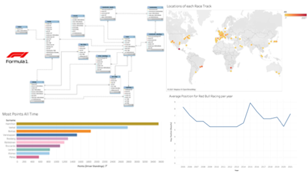
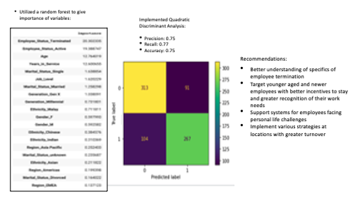
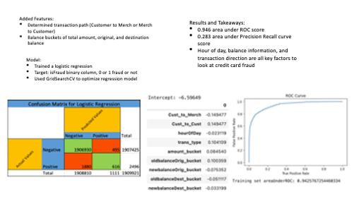
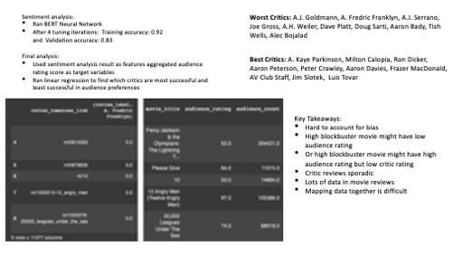
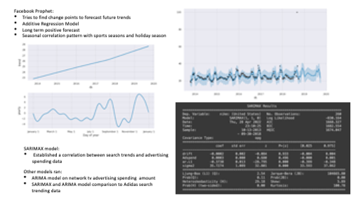

## Project Portfolio

---

### CU Athletics Game Day Experience Analysis
Determine most influential factors in gameday experience for fans based on fan survey data with CU Athletics Football 

 

---

### Formula One Database Development
Develop a relational database with Formula 1 data and created visualizations of the data 

---

### Employee Turnover Analysis
Determined which factors contributed most to voluntary employee termination with a Fortune 500 Technology company   

---

### Product Quality Control Analysis
Determined cause and impact of why shades and shutters were having to be returned for remake or repair with an industry leading provider of widow coverings

---

### Fraudalant Transaction Analysis
Used PySpark programming to determine fraudulent transactions and which features are the most common red flags in fraudulent transactions

---

### Movie Critic Reviews Analysis
Used a movie reviews dataset to determine which movies were liked and disliked by critics then analyzed which critics aligned most with audience preferences 

---

### Nike Advertising Data Analysis 
Used Facebook prophet and other models for analysis to compare Nike search trends with Nike advertising spending 

